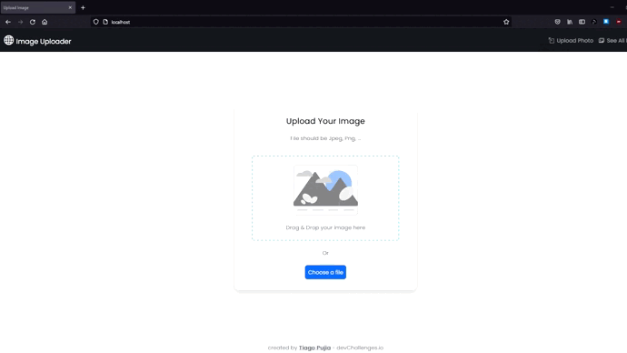

<h1 align="center">image-uploader</h1>

<div align="center">
   Solución para un desafío de  <a href="http://devchallenges.io" target="_blank">Devchallenges.io</a>.
</div>


## TABLA DE CONTENIDO

-   [Visión General](#visión-general)
    -   [Construido con](#construido-con)
-   [Características](#características)
-   [Cómo utilizar](#cómo-utilizar)
-   [Contacto](#contacto)

## Visión General



La idea de este proyecto es crear una aplicación que permite que un cliente ingrese imagenes a la base de datos, y despues esta pueda verse dentro de la app.

### Construido con

-   [Bootstrap](https://getbootstrap.com/)
-   [Bootstrap-Icons](https://icons.getbootstrap.com/)

## Características

Esta aplicación/sitio se creó como envío a un desafío [DevChallenges](https://devchallenges.io/challenges). El [desafío](https://devchallenges.io/challenges/O2iGT9yBd6xZBrOcVirx) fue crear una aplicación para completar las historias de usuario dadas.


## Cómo utilizar

Para clonar y ejecutar esta aplicación, necesitará Git y un servidor para PHP y MySQL (como laragon o xampp)

```bash
# Clonar este repositorio
$ git clone https://github.com/Tiago-Pujia/image-uploader

# Crear Base de Datos
source ...\database\database.sql;
```

## Ruta de Archivos
El proyecto esta formado por la siguiente ruta de carpetas:
```
-> Carpeta root
    -> previewPhoto - Visualizador de fotos
    -> AllPhotos - Ver todas las fotos

    -> API - Backend
    -> database - Archivos SQL

    -> img - Imagenes
    -> templates - Documentos HTML de template
    -> scripts - Scripts de template
    -> independences - FrameWorks y librerias

    -> index.html y index.js - inicio de la pagina
```

## Contacto

-   Website [tiago.ar](http://tiago.ar/)
-   GitHub [Tiago-Pujia](https://github.com/Tiago-Pujia/)
-   Instagram [tiago_nahuel\_\_](https://instagram.com/tiago_nahuel__)
-   Email tiagonahuelpujia@gmail.com
